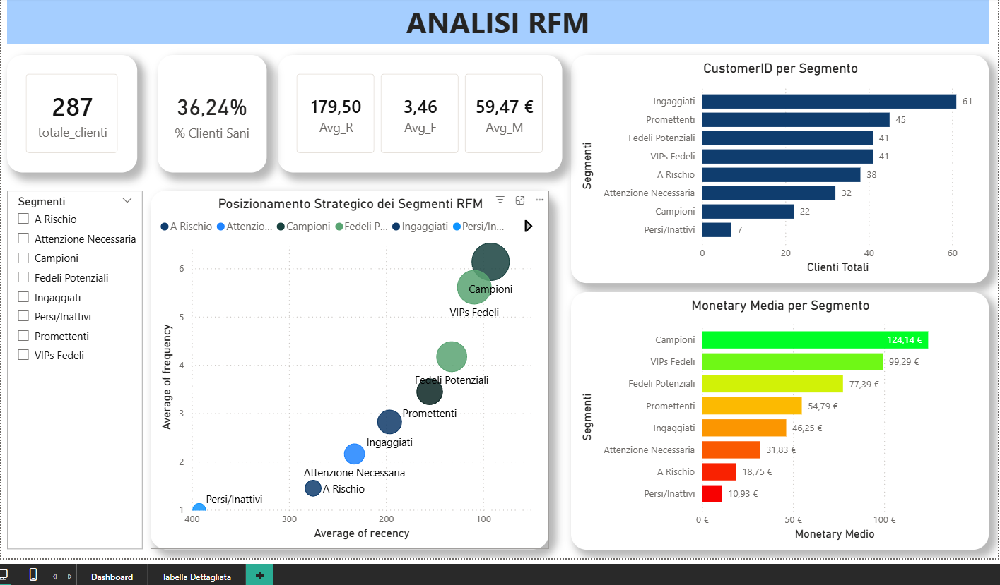

# Analisi RFM — BigQuery & Power BI

## Executive Summary

- **Business Problem**: Un'azienda con 287 clienti attivi non ha visibilità su chi sta per abbandonare, chi ha alto potenziale inespresso e chi merita azioni di retention prioritarie.
- **Soluzione**: Segmentazione RFM completa in BigQuery su 12 mesi di dati di vendita, con scoring a 10 livelli per ciascuna dimensione e dashboard interattiva in Power BI per il monitoraggio dei segmenti.
- **Risultati**: 287 clienti classificati in 8 segmenti actionable; identificati 22 Campioni (Avg Monetary 124€) e 7 Persi/Inattivi (Avg Monetary 10,93€); solo il 36,24% dei clienti rientra nella fascia "sana".
- **Prossimi Passi**: Integrare i segmenti con dati di campagna email per misurare la risposta per segmento; aggiornare l'analisi mensilmente tramite automazione.

---

## Business Problem

Trattare tutti i clienti allo stesso modo è uno spreco di risorse: i Campioni meritano programmi di loyalty, i Promettenti hanno bisogno di essere attivati, i Persi/Inattivi richiedono campagne di win-back o vanno deprioritizzati. Senza una segmentazione strutturata, queste decisioni vengono prese per intuizione invece che per dati.

*"Chi sono i nostri clienti più preziosi?"*, *"Chi rischiamo di perdere?"*, *"Dove conviene investire il budget marketing?"*

---

## Metodologia

1. **Consolidamento dati (Step 1)** → Le 12 tabelle mensili di vendita 2025 vengono unite in un'unica tabella `vendite_2025` tramite `UNION ALL` in BigQuery.
2. **Calcolo metriche RFM (Step 2)** → Per ogni cliente vengono calcolati:
   - **Recency** → giorni dall'ultimo acquisto alla data di analisi, tramite `DATE_DIFF()`
   - **Frequency** → numero totale di ordini
   - **Monetary** → valore totale speso
   - Ranking per ciascuna dimensione con `ROW_NUMBER() OVER()`
3. **Scoring (Step 3)** → Ogni cliente riceve un punteggio da 1 a 10 per ciascuna dimensione tramite `NTILE(10)`, dove 10 rappresenta la performance migliore.
4. **Punteggio totale (Step 4)** → I tre punteggi vengono sommati in un `rfm_totale_p` (range 3–30).
5. **Segmentazione finale (Step 5)** → I clienti vengono classificati in 8 segmenti sulla base del punteggio totale, salvati in una tabella fisica per il consumo da Power BI.

---

## Competenze

- **SQL (BigQuery)**: `UNION ALL`, CTE, Window Functions (`ROW_NUMBER`, `NTILE`), `DATE_DIFF()`, Views e tabelle materializzate, `CREATE OR REPLACE TABLE/VIEW`
- **Power BI**: Scatter plot con dimensione bubble, bar chart con scala cromatica per segmento, KPI cards, filtri dinamici per segmento, tabella dettaglio

---

## Risultati & Raccomandazioni

| Segmento | Clienti | Monetary Media | Azione Consigliata |
|---|---|---|---|
| Campioni | 22 | 124,14 € | Programma loyalty, early access offerte |
| VIPs Fedeli | 41 | 99,29 € | Upselling, referral program |
| Fedeli Potenziali | 41 | 77,39 € | Incentivi per aumentare frequenza |
| Promettenti | 45 | 54,79 € | Onboarding mirato, offerte personalizzate |
| Ingaggiati | 61 | 46,25 € | Campagne di attivazione |
| Attenzione Necessaria | 32 | 31,83 € | Offerte di re-engagement |
| A Rischio | 38 | 18,75 € | Campagne win-back urgenti |
| Persi/Inattivi | 7 | 10,93 € | Valutare se deprioritizzare |

**Insight chiave**: Il 36,24% dei clienti è classificato come "sano" (Campioni + VIPs Fedeli + Fedeli Potenziali). Il segmento più numeroso è quello degli Ingaggiati (61 clienti) — clienti con buona frequenza ma monetary ancora bassa, il target ideale per campagne di upselling.

---

## Prossimi Passi

1. Integrare i segmenti RFM con i dati delle campagne email per misurare conversion rate per segmento.
2. Automatizzare l'aggiornamento mensile della tabella `rfm_segmenti_finali` tramite BigQuery Scheduled Queries.
3. Aggiungere un'analisi di migrazione segmento per tracciare i clienti che migliorano o peggiorano di tier mese su mese.

---

## Dashboard



---

```

**Stack**: BigQuery (SQL) · Power BI
